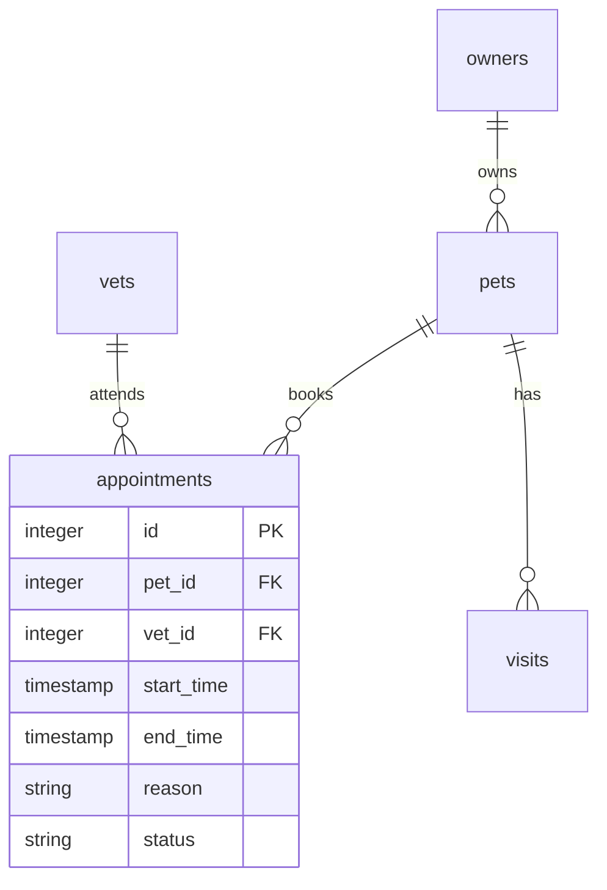

# 예약 API

예약은 `appointments`에 저장하며 기존 `visits` 진료 기록과 별도로 관리합니다.
보호자를 중복 저장하지 않고 `appointments.pet_id → pets.owner_id`로 현재 보호자를 조회합니다.



기본 주소: `http://localhost:9966/petclinic/api`

| 메서드 | 경로 | 기능 |
| --- | --- | --- |
| POST | `/appointments` | 예약 생성, 201 및 Location 헤더 |
| GET | `/appointments` | 필터 및 페이지 조회 |
| GET | `/appointments/{id}` | 상세 조회 |
| PUT | `/appointments/{id}` | 예약 정보 전체 변경 |
| POST | `/appointments/{id}/cancel` | 취소, 반복 호출 가능 |

생성과 변경에는 다음 JSON을 전달합니다. `id`, `ownerId`, `status`는 서버에서 계산합니다.

```json
{
  "petId": 1,
  "vetId": 1,
  "startTime": "2026-09-20T10:00:00+09:00",
  "endTime": "2026-09-20T10:30:00+09:00",
  "reason": "예방접종"
}
```

예시 응답:

```json
{
  "id": 1,
  "petId": 1,
  "vetId": 1,
  "ownerId": 1,
  "startTime": "2026-09-20T01:00:00Z",
  "endTime": "2026-09-20T01:30:00Z",
  "reason": "예방접종",
  "status": "SCHEDULED"
}
```

시간대가 포함된 ISO 8601 시간을 입력해야 합니다. DB에는 UTC를 저장하고 응답도 UTC로 반환합니다.
시간은 마이크로초 단위로 정규화합니다. 시작 시간은 미래여야 하고 종료 시간은 시작보다 늦어야 합니다.
사유는 공백을 제외한 내용이 있어야 하며 최대 255자입니다.

같은 반려동물 또는 같은 수의사의 `SCHEDULED` 예약은 시간이 겹칠 수 없습니다.
한 예약의 종료 시각에 다음 예약이 시작하는 것은 허용합니다.
충돌 검사는 공통 DB 트랜잭션과 반려동물·수의사 잠금으로 동시 요청에서도 적용합니다.

생성 상태는 `SCHEDULED`이며 취소하면 `CANCELLED`로 변경해 기록을 남깁니다.
시작된 예약은 변경하거나 취소할 수 없고, 취소된 예약을 수정해 다시 활성화할 수 없습니다.
취소된 시간은 새 예약에서 사용할 수 있습니다. 진료 완료 기록은 기존 `/visits` API로 등록합니다.
반려동물이나 수의사를 삭제하면 연결된 예약도 FK의 `ON DELETE CASCADE`로 삭제됩니다.

목록 쿼리:

| 파라미터 | 의미 |
| --- | --- |
| petId, vetId, ownerId | 해당 반려동물, 수의사, 현재 보호자로 필터 |
| status | `SCHEDULED` 또는 `CANCELLED`; 생략하면 모두 조회 |
| from, to | `[from, to)` 구간과 겹치는 예약; 한쪽만 지정 가능 |
| limit | 기본 20, 최대 100 |
| offset | 기본 0, 건너뛸 예약 수 |

예: `GET /appointments?ownerId=1&status=SCHEDULED&limit=20&offset=0`
시간대의 `+`를 쿼리에 넣을 때는 `%2B`로 URL 인코딩합니다.
결과는 시작 시간과 ID 순서로 정렬한 배열이며 결과가 없으면 `200 []`를 반환합니다.

입력 오류는 400, 예약·반려동물·수의사 부재는 404, 중복 및 변경 불가능 상태는 409입니다.
오류 응답은 기존 ProblemDetail 형식을 사용합니다.

H2, HSQLDB, PostgreSQL, MySQL 스키마에 예약 테이블과 검색 인덱스를 추가했습니다.
예약 저장소는 동일한 데이터소스를 사용하는 JDBC로 구현해 `jdbc`, `jpa`, `spring-data-jpa` 프로필에서 사용합니다.
HSQLDB 스키마는 재실행 시 테이블을 삭제하지 않고 `IF NOT EXISTS`로 생성하도록 변경했습니다.
현재 기본 H2는 메모리 DB이므로 서버 종료 시 데이터가 없어집니다.

보안은 기본적으로 활성화되며 로그인에서 받은 JWT를 `Authorization: Bearer <accessToken>`으로 전달합니다.
`user_profiles`로 사용자와 보호자·수의사를 연결합니다. 보호자는 본인 예약만, 수의사는 본인에게 배정된 예약만 조회합니다.
예약 생성·일정 변경은 보호자 본인과 관리자에게 허용하며 취소는 배정된 수의사도 가능합니다.
회원가입·로그인과 계정 생성 방법은 [인증 문서](authentication.md)를 참고하세요.

검증:

```text
mvnw.cmd -Dtest=AppointmentRestControllerTests test
```

H2와 HSQLDB에서 생성·조회·필터·일정 변경·취소·입력 검증·페이지 조회·시간대 변환·동시 중복 예약을 검증합니다.
