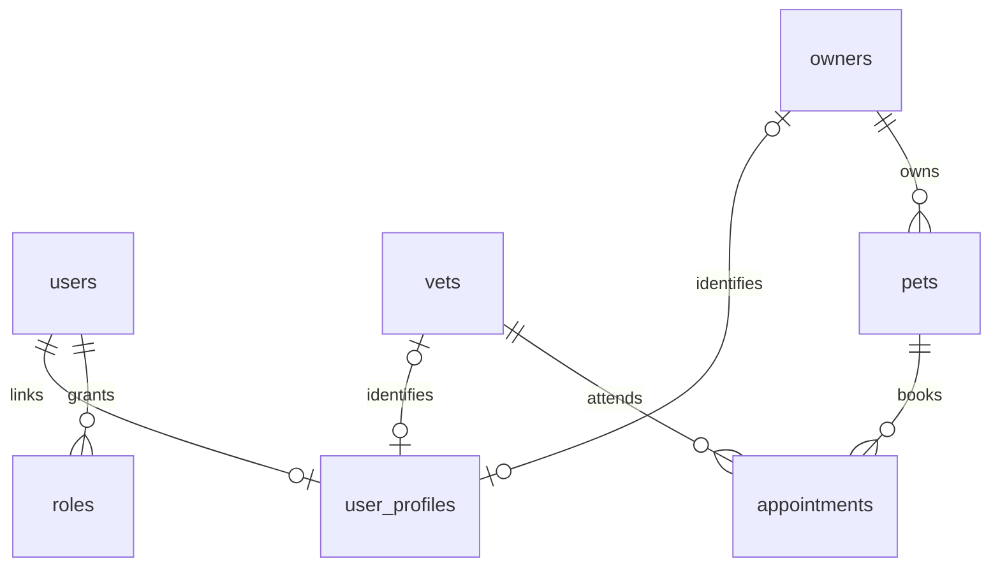

# 회원가입·로그인·권한

기본 주소는 `http://localhost:9966/petclinic/api`입니다.

| 메서드 | 경로 | 접근 |
| --- | --- | --- |
| POST | `/auth/signup` | 공개 보호자 회원가입 |
| POST | `/auth/login` | 공개 로그인 및 JWT 발급 |
| GET | `/auth/me` | 인증된 사용자 본인 정보 |
| POST | `/users` | 관리자만 계정 생성 및 기존 보호자·수의사 연결 |

## 보호자 회원가입

```json
{
  "username": "owner.one",
  "password": "PassWord123!",
  "authCode": "OWNER",
  "firstName": "홍",
  "lastName": "길동",
  "address": "서울시 테스트로 123",
  "city": "서울",
  "telephone": "6085551023"
}
```

`authCode`를 생략해도 `OWNER`로 가입합니다. `VETS`, `ADMIN`, 기존 관리자 역할을 요구하면 403입니다.
클라이언트가 `ownerId`, `vetId`, `roles` 같은 필드를 덧붙여도 기존 보호자 데이터나 관리자 권한을 얻을 수 없습니다.
서버가 새 보호자 레코드와 `ROLE_OWNER` 계정을 하나의 트랜잭션으로 생성합니다.
중복 아이디는 409이며 동시 가입에서도 계정과 보호자가 중복 생성되지 않습니다.

아이디는 영문·숫자·점·밑줄·하이픈 3~20자입니다.
비밀번호는 최소 8자, 최대 72 UTF-8 바이트이며 BCrypt로 해시해 저장합니다.
기존 보호자 모델에 맞춰 전화번호는 숫자 10자리입니다.

```json
{
  "username": "owner.one",
  "authCode": "OWNER",
  "ownerId": 11,
  "vetId": null
}
```

## 로그인과 토큰

```json
{
  "username": "owner.one",
  "password": "PassWord123!"
}
```

`POST /auth/login` 응답:

```json
{
  "accessToken": "eyJ...",
  "tokenType": "Bearer",
  "expiresIn": 3600,
  "user": {
    "username": "owner.one",
    "authCode": "OWNER",
    "ownerId": 11,
    "vetId": null
  }
}
```

그 다음 API 호출에 아래 헤더를 넣습니다. 쿠키나 서버 세션은 사용하지 않습니다.

```text
Authorization: Bearer <accessToken>
```

로그인 실패·비활성 계정·서명 변조·만료·다른 발급자 또는 대상의 토큰은 401입니다.
권한이 부족하거나 다른 사용자 데이터에 접근하면 403입니다.
토큰에는 발급자, 대상, 사용자명, 발급·유효 시작·만료 시각, 고유 ID, 역할과 연결 정보가 들어갑니다.
JWT는 [Spring Security의 Nimbus 구현](https://docs.spring.io/spring-security/reference/servlet/oauth2/resource-server/jwt.html)으로 HS256 서명을 생성·검증합니다.
매 요청마다 DB의 현재 계정 활성 상태와 역할을 확인하므로 토큰의 오래된 역할·프로필 주장으로 권한을 바꿀 수 없습니다.
계정 비활성화는 기존 토큰에도 즉시 반영됩니다. 비밀번호와 해시는 API 응답에 포함하지 않습니다.
리프레시 토큰은 발급하지 않으므로 만료 후 다시 로그인합니다.

Swagger UI의 **Authorize**에 로그인에서 받은 토큰을 넣어 API를 실행할 수 있습니다.
로컬 초기 데이터에는 다음 샘플 계정 3개가 있습니다. 비밀번호는 모두 `admin`이며 BCrypt로 저장됩니다.

| 구분 | 아이디 | 비밀번호 | 연결 데이터 |
| --- | --- | --- | --- |
| 보호자 | `owner` | `admin` | 보호자 ID 1 (George Franklin) |
| 수의사 | `vet` | `admin` | 수의사 ID 1 (James Carter) |
| 관리자 | `admin` | `admin` | 전체 관리 권한 |

H2·HSQLDB·MySQL·PostgreSQL 초기 데이터에 동일하게 구성되어 있으며, 초기 데이터가 로드되도록 애플리케이션을 재시작한 뒤 로그인할 수 있습니다.

## 수의사·관리자 계정

관리자는 먼저 `/vets`에서 수의사 정보를 만든 뒤 해당 ID로 `/users`를 호출합니다.

```json
{
  "username": "vet.one",
  "password": "PassWord123!",
  "enabled": true,
  "vetId": 1,
  "roles": [{ "name": "VET" }]
}
```

내부 역할 `VET`는 외부 `authCode: VETS`에 대응합니다. 계정 생성에서는 `VETS` 별칭도 받습니다.
기존 보호자 정보에 계정을 연결할 때는 `ownerId`와 `roles: [{"name":"OWNER"}]`를 전달합니다.
각 보호자·수의사 레코드는 계정 하나에만 연결할 수 있습니다.
관리자 계정 생성은 `roles: [{"name":"ADMIN"}]`을 사용하며 `ownerId`·`vetId`는 필요 없습니다.
존재하지 않는 연결 ID는 404, 이미 연결된 프로필 또는 아이디는 409입니다.

## 권한별 동작

| 동작 | OWNER | VETS | ADMIN |
| --- | --- | --- | --- |
| 본인 계정 조회 | 가능 | 가능 | 가능 |
| 수의사·종류·전문분야 목록 조회 | 가능 | 가능 | 가능 |
| 보호자·반려동물·진료 기록 조회 | 본인 데이터 | 배정 예약의 관련 데이터 | 전체 |
| 보호자 정보·반려동물 변경 | 본인 데이터 | 불가 | 전체 |
| 보호자 정보 생성·삭제 | 불가; 가입에서 생성 | 불가 | 가능 |
| 진료 기록 작성·변경·삭제 | 불가 | 배정된 반려동물 | 전체 |
| 예약 목록·상세 조회 | 본인 예약 | 본인에게 배정된 예약 | 전체 |
| 예약 생성·일정 변경 | 본인 반려동물 | 불가 | 전체 |
| 예약 취소 | 본인 예약 | 본인에게 배정된 예약 | 전체 |
| 계정·수의사·전문분야·반려동물 종류 관리 | 불가 | 불가 | 가능 |

예약 시작 후 변경·취소 금지와 예약 시간 중복 검사는 기존 규칙을 유지합니다.
목록과 페이지 조회는 본인에게 허용된 데이터만 반환하고 전체 건수도 해당 범위로 계산합니다.
수의사의 보호자 조회 응답에서도 배정되지 않은 다른 반려동물은 제외합니다.
수의사의 진료 정보 접근은 취소되지 않은 예약의 배정 관계를 기준으로 합니다.

기존 `ROLE_OWNER_ADMIN`, `ROLE_VET_ADMIN`은 부서 관리 역할로 유지합니다.
새 보호자·수의사 계정에는 해당 역할을 부여하지 않으며, 기존 샘플 관리자에는 두 역할과 `ROLE_ADMIN`이 있습니다.

## DB와 실행 설정

기존 `users`, `roles`를 유지하고 별도의 `user_profiles`를 추가합니다.



로그인·가입 저장소는 공유 데이터소스의 JDBC를 사용하므로 기존 세 저장소 프로필과 함께 동작합니다.
H2·HSQLDB·PostgreSQL·MySQL 스키마에 `user_profiles` 생성 DDL을 추가했으며 기존 테이블 삭제나 변경은 필요 없습니다.
기존 계정의 비밀번호는 BCrypt 해시여야 로그인할 수 있습니다. 로컬 샘플 관리자는 이미 BCrypt입니다.

`petclinic.security.enable=true`를 기본값으로 설정했습니다. 이제 로그인·가입·Swagger·헬스 체크 이외에는 토큰이 필요합니다.
명시적으로 `false`로 설정하면 개발용으로 API 접근 검증을 끕니다.

토큰 수명은 `petclinic.jwt.access-token-ttl`로 지정하며 기본 3600초, 허용 범위는 60~86400초입니다.
`JWT_SECRET` 환경변수에 최소 32바이트의 무작위 키를 Base64 인코딩해 설정할 수 있습니다.
지정하지 않으면 시작할 때 무작위 키를 생성하므로 이전 프로세스에서 받은 토큰은 재시작 후 유효하지 않습니다.
여러 서버에서 동일 토큰을 검증하거나 재시작 후 유지하려면 동일한 비밀키를 안전하게 공급해야 합니다.
현재 기본 H2는 메모리 DB이므로 재시작 시 회원·예약 데이터가 초기화됩니다.

## 검증

```text
mvnw.cmd -Dtest=AuthSecurityTests,AuthSecurityH2Tests test
```

실제 보안 필터·DB·JWT 서명을 사용해 가입, 중복·동시 가입, 해시, 로그인, 만료·변조,
현재 DB 권한 적용, 관리자 계정 생성, 타인 데이터 접근, 예약 범위, CORS, 공개 문서를 검증합니다.
